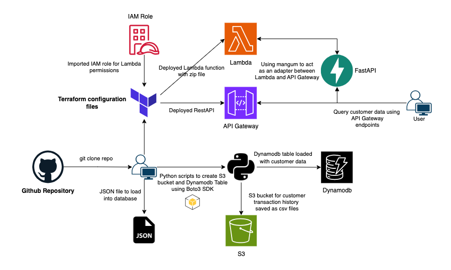

# Serverless Customer Data Management System

## About This Project

This project is a **serverless customer data management system** built to showcase a robust, scalable, and cost-efficient architecture using AWS services. It leverages modern cloud technologies to manage customer data, query endpoints, and ensure seamless integration across components.

---

## How to Get Started

### Step 1: Clone the Repository

- Clone the project repository from GitHub to your local machine.

### Step 2: Prepare Customer Data

- Create a **JSON file** containing customer data (e.g., customer details, addresses, and transaction history URLs).
- Ensure the JSON file is formatted properly for bulk upload into DynamoDB.

### Step 3: Set Up the Environment

- Create a **virtual environment** for Python and activate it.
- Install all required dependencies from the `requirements.txt` file.

### Step 4: Implement AWS Services in Python

- Develop **separate Python scripts** to:
  - Upload the csv files data to an **S3 bucket**.
  - Using JSON file load the **DynamoDB table** with customer data.

### Step 5: Implement the FastAPI Framework

- Integrate **FastAPI** to handle **GET** methods, enabling queries to the DynamoDB table.
- Set up endpoint routes to:
  - Retrieve all customer data.
  - Query specific customer details using the `customerId`.

### Step 6: Use Mangum for AWS Integration

- Use **Mangum** to adapt the FastAPI application for AWS Lambda and API Gateway compatibility.

### Step 7: Configure and Deploy AWS Lambda

- Zip the Python dependencies and scripts needed for the **Lambda function**.
- Deploy Lambda using **Terraform**, defining:
  - The Lambda function resource.
  - An IAM role for appropriate permissions.
  - An **API Gateway** to serve as the entry point.

### Step 8: Query Customer Data via API Gateway

- Use API Gateway endpoints to:
  - Retrieve all customer data from the DynamoDB table.
  - Query specific customer details.

### Step 9: Test and Verify

- Test all components, including:
  - csv and JSON data upload to S3 and DynamoDB.
  - Lambda function execution.
  - API Gateway endpoints for FastAPI integration.

---

## Technologies Used

- **Python**: Backend scripting and data processing.
- **Terraform**: Infrastructure as code for AWS resources.
- **S3**: Storage for customer transaction history.
- **DynamoDB**: Serverless NoSQL database for customer data.
- **Lambda**: Serverless compute service for running FastAPI.
- **FastAPI**: Lightweight web framework for API development.
- **API Gateway**: Gateway to expose and secure Lambda endpoints.
- **JSON**: Format for loading customer data into DynamoDB.

---

## Features

- Efficiently manages and queries customer data.
- Role-based credentials ensure secure, temporary, and least-privilege access to AWS resources
- Serverless architecture ensuring scalability and cost-effectiveness.
- Clean and reusable deployment process using Terraform.
- Easy-to-use API Gateway endpoints for accessing customer information.

---

### Next Steps

- Implement further security measures, such as API key validation or AWS Cognito integration.
- Implement CI/CD to enable continuous integration and continuous deployment
- Add logging and monitoring for improved system diagnostics.
- Enhance technical documentation with endpoint examples and responses.
